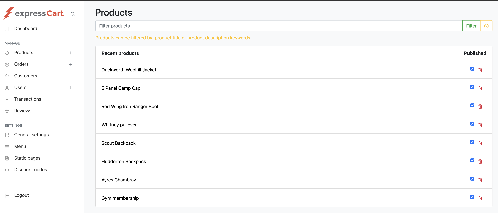
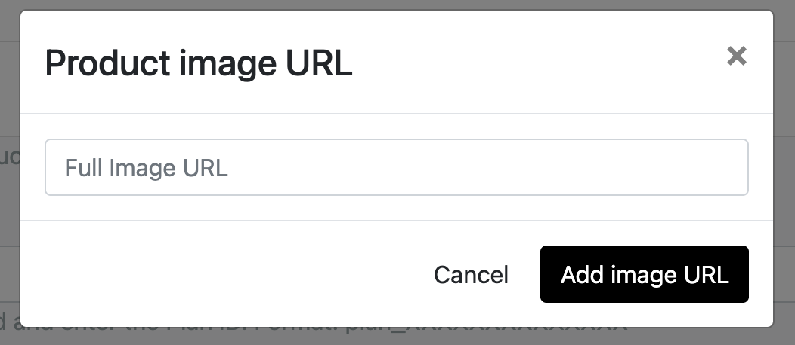
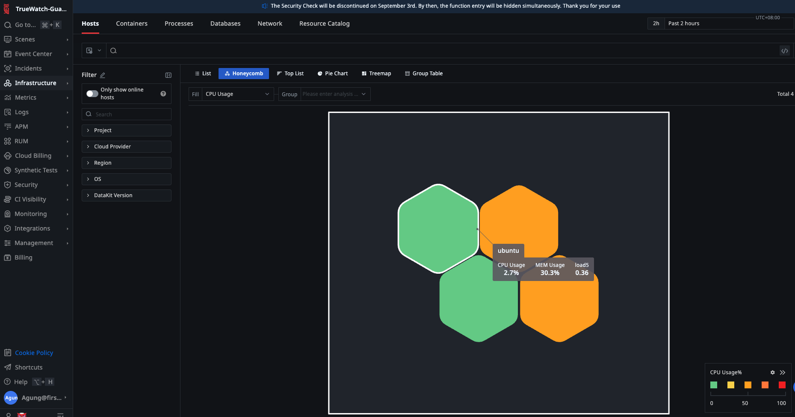
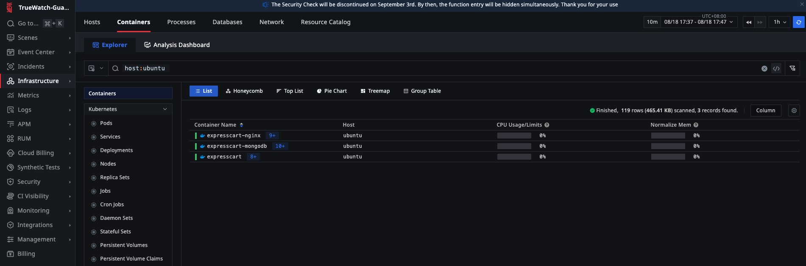
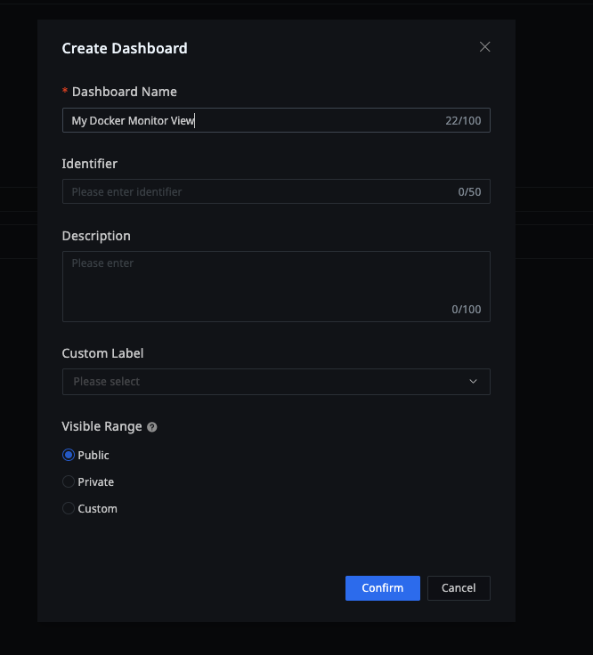
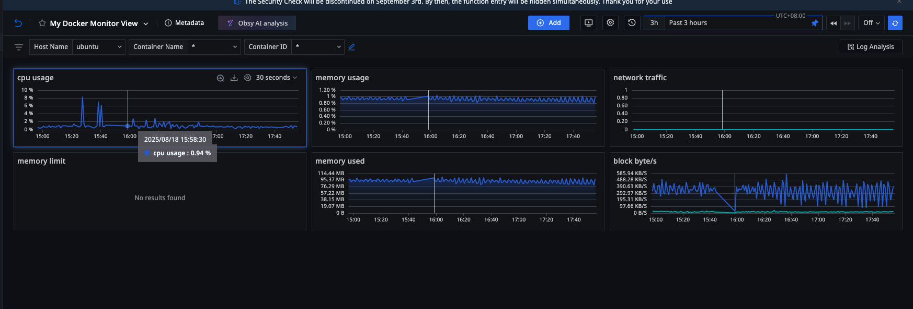
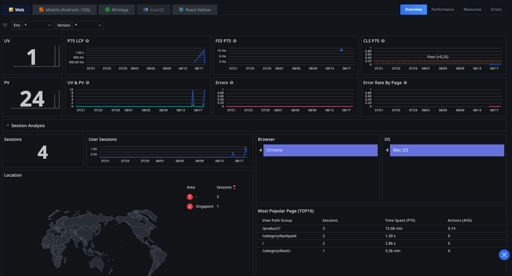

### 🌟 This is Truewatchshop apps based on expresscart by Markmoffat

Check out expresscart documentation [📖 here](https://github.com/mrvautin/expressCart/wiki).

---

> **ℹ️ Intention:**  
> The purpose of **Truewatchshop** is to provide a training sandbox environment for customers and partners.  
> This sandbox allows users to explore, experiment, and learn about monitoring, tracing, and application performance management using Truewatch in a safe, hands-on setting.  
> Application has been instrumented, focus of the training sandbox is how to onboard the data and get familiar to Truewatch platform and workflow.

---

### 🛠️ Tech Stack

The project is built using the following technologies:

1. **Node.js**: 🟢 Backend runtime environment for running JavaScript.  
2. **Express.js**: 🚀 Web framework for building the application.  
3. **MongoDB**: 🗄️ NoSQL database for storing application data.  
4. **Docker**: 🐳 Containerization platform for deploying the application.  
5. **Nginx**: 🌐 Web server used as a reverse proxy.  
6. **Truewatch RUM / APM / LOG**: 📊 Monitoring and tracing tool for performance and debugging.  

---

### ⚙️ Pre-requisites

Before you begin, please make sure you have the following:

1. **Truewatch Account** 📝  
   Register for a Truewatch account at [truewatch.com](https://id1-auth.truewatch.com/businessRegister) to access monitoring and analytics features.

2. **Linux System with Internet Connection** 💻  
   Use a Linux machine (physical or virtual) with a stable internet connection.  
   > *Tip: We recommend using a Linux VM for isolation and ease of setup. If you don’t have one, you can use [Oracle VirtualBox](https://www.virtualbox.org/) for Windows machine or [OrbStack](https://orbstack.dev/) for MacOS to create a virtual environment.*  
   This training sandbox is created using **Orbstack** and **Ubuntu 22.04.5 LTS**.  

   - If you choose to use Orbstack, you can find the install guide [here](https://docs.orbstack.dev/).  
   - If you choose to use Virtualbox, you can find the install guide [here](https://www.virtualbox.org/manual/ch01.html).  

   Create a Linux VM with **Ubuntu 22.04.5 LTS**.

3. **DataKit Installed** 📦  
   Install DataKit from your Truewatch account to enable tracing and monitoring.  
   More on Official Datakit installation [here](https://docs.truewatch.com/datakit/datakit-install/).  

   To install your Datakit:  
   - Go to your [Truewatch platform](https://id1-auth.truewatch.com), and log in with your Truewatch credentials.  
   - Navigate to **Integrations > Datakit**.  
   - Copy the *Deploy Script* highlighted in green as shown in the snapshot below.  

       

   - Go to your freshly installed Linux machine and apply the *Deploy Script* in the console:  
     ```bash
     DK_DATAWAY="https://id1-openway.truewatch.com?token=tkn_xxxxxxxx" bash -c "$(curl -L https://static.truewatch.com/datakit/install.sh)" 
     ```
   - Verify **datakit** is running:  
     ```bash
     ps aux | grep datakit
     root         806 11.6  0.3 2036304 34012 ?       Sl   01:59 116:22 /usr/local/datakit/externals/datakit-ebpf run --datakit-apiserver 0.0.0.0:9529 --hostname ubuntu --l7net-enabled httpflow --pprof-host 127.0.0.1 --pprof-port 6061 --netlog-metric --netlog-log --trace-env-list DK_BPFTRACE_SERVICE,DD_SERVICE,OTEL_SERVICE_NAME --enabled ebpf-net,ebpf-trace 
     ```

4. **Docker** 🐳  
   Install Docker to run the application in containers.  
   [Get Docker instructions here](https://docs.docker.com/get-docker/).  
   ```bash
   sudo apt-get update
   sudo apt-get install -y git docker.io docker-compose
   sudo usermod -aG docker $USER
   newgrp docker
   ```
   > *Note: The last two commands add your user to the `docker` group so you can run Docker without `sudo`. You may need to log out and log back in for this.*

5. **Git** 🧰  
   Install Git to clone the repository and manage source code:  
   ```bash
   sudo apt-get update
   sudo apt-get install -y git
   ```

---

### 🚀 Steps to Set Up the Project

1. **Clone the repository:**  
   ```bash
   git clone https://github.com/TrueWatchTech/expresscart-demo-setup-guide
   cd expresscart-demo-setup-guide
   ```

2. **Install dependencies and build the project:**  
   ```bash
   docker-compose build
   ```

3. **Start the services:**  
   ```bash
   docker-compose up -d
   ```

4. **Populate the database with test data:**  
   ```bash
   docker exec -it expresscart npm run testdata
   ```

5. ***[Optional]*** **Customize product image:**  
   - Go to the Truewatchshop [admin page](http://localhost:8080/admin/dashboard).  
   - Login using the following credentials:  
      - **Username**: `owner@test.com`  
      - **Password**: `test`  
   - Navigate to **Products**.  
     
       
     
   - Locate the product **"Duckworth Woolfill Jacket"** and click on **add image URL** at the bottom. A **Product Image URL** window will appear.  
     
       
     
   - Open a new browser tab and search for an image URL on Google using the keyword *Duckworth Woolfill Jacket*. For example, you can use this URL:  
     `https://content.steepandcheap.com/images/items/large/FJR/FJRZ0M5/GRE.jpg`.  
   - Copy the URL to the **Product Image URL** and add the image.  
   - Repeat the above steps for other products to update their image URLs.  

   > *Note: You can monitor image load times from RUM stats.*

---

### 📊 Steps to Set Up Infra Monitoring


1. By installing Datakit as shown in the **Step 3** [Pre-requisites](#️-pre-requisites) section.  
   The Linux host installed with datakit will send its metrics data to the Truewatch platform.  
   Validate this by going to your [Truewatch platform](https://id1-auth.truewatch.com).  
   Navigate to **Infrastructure > Host**. Click on **Honeycomb** to change the view to *Honeycomb View*.  
   
     
   
   You should be able to see your host. Hover your mouse to see your host's at-a-glance key metrics (CPU, MEM Usage, load5).  

2. Enable container monitoring, in this case Docker, by configuring Datakit *container.conf*:  
   - Go to your Linux console, change the directory to */usr/local/datakit/conf.d/container/*. Then copy *container.conf.sample* to *container.conf* and restart Datakit:  
     ```bash
     cd /usr/local/datakit/conf.d/container
     sudo cp container.conf.sample container.conf
     sudo datakit service -R
     ```

   Validate this by going to your [Truewatch platform](https://id1-auth.truewatch.com).  
   Navigate to **Infrastructure > Containers**.  
   
   

   Explore **Containers** View by Clicking the names of the container

3. Navigate to **Scenes > New Dashboard**. Under **Template Name** type *Docker*, hit enter. You'll get *Docker Monitor View* Template, Click on it. Give it a name and click confirm.  
   
   

4. After the above step, you'll arrive at the Docker Monitor View. Below is the example, you can apply filter using fields on the top left namely *(Host Name, Container Name, Container ID)*.  
   
   


> Infrastructure monitoring is essential for maintaining the health, performance, and reliability of your application environment. By using Truewatch, you gain real-time visibility into your servers, containers, and network resources. This enables you to quickly detect issues, optimize resource usage, and ensure a seamless experience for your users.
---

### 🌐 Steps to Set Up RUM

1. Go to your [Truewatch platform](https://id1-auth.truewatch.com), and log in with your Truewatch credentials.  
   Create a client token:  
   Go to **Management > Client Token > Create**. Copy the newly created token and save it somewhere safe; you will need this for the next step.  
   
   

2. Log in to your Truewatch console and go to **Real User Monitoring > Application List > Create Application**.  
   
   

3. Select **Web** as the **App Type**. Enter a name for the application in the **App Name** field and specify the **App Id**.  
   
   

4. Select **Public DataWay Deployment**, then choose **CDN Asynchronous Loading**. Enter the **Client Token** you saved earlier in the **clientToken** section.  
   
   

5. Enter the following values (or values that best describe your application):  
   - **service** = *frontend*  
   - **env** = *production*  
   - **version** = *1.0.0.0*  
   
   

   Copy the autogenerated script *highlighted in green* and save it in your favourite editor.

6. Instrument Nginx to use the parameters above:  
   - Go to your *expresscart-demo-setup-guide* directory on your console, navigate to *nginx/conf.d*  
     ```bash
     cd expresscart-demo-setup-guide
     cd nginx/conf.d/
     ```
   - Edit *default.conf* with your favourite editor, and paste the values from the autogenerated script in step 5.
   
     
   


   > *Note: We configured Nginx to autoinstrument the RUM agent by injecting the script using the sub_filter directive, resulting in the RUM agent being instrumented into client browsers. Using this method, you don't have to modify your frontend HTML code. More on the Nginx sub_filter directive [here](https://nginx.org/en/docs/http/ngx_http_sub_module.html).*

7. Start and stop the services:
   ```bash
   docker-compose down
   docker-compose up -d
   ```

8. Open your browser and go to [http://localhost:8080](http://localhost:8080). You should be able to view your web app running on port 8080.  
   
   

9. Interact with your app:  
   - Login with user *test@test.com* and password *test*.  
   - Simulate a user selecting a product to cart. 

10. Go to your [Truewatch Platform](https://id1-auth.truewatch.com), go to **RUM > Application**, and select your App.  
    Observe statistics under **Analysis Dashboard**.  
    

---

### ⚡ Steps to Set Up APM

**WIP**