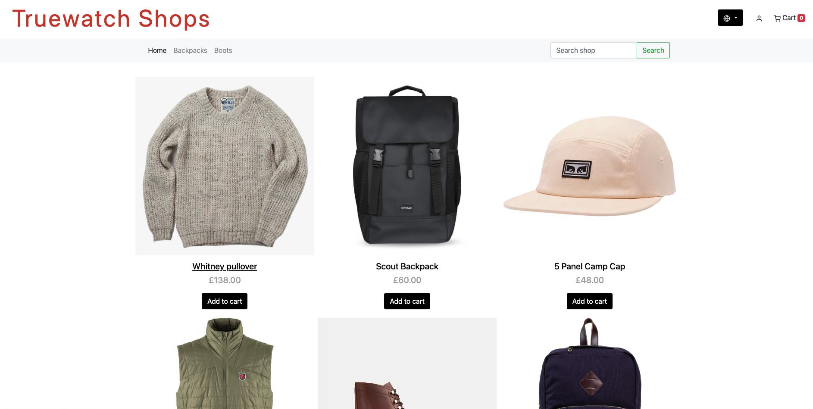
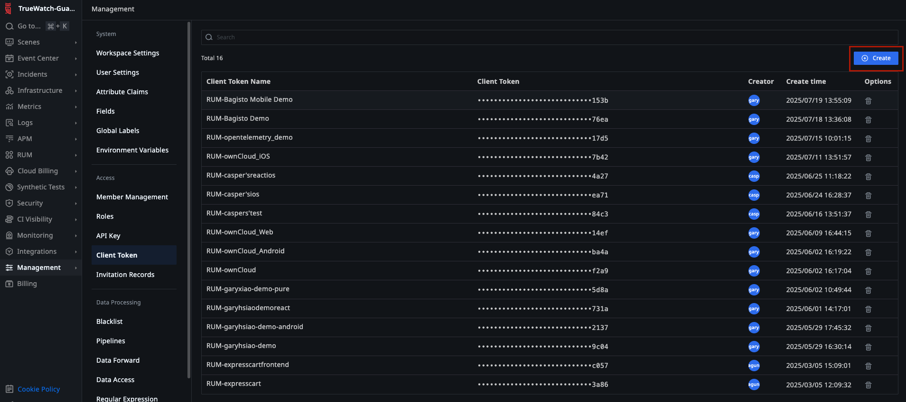
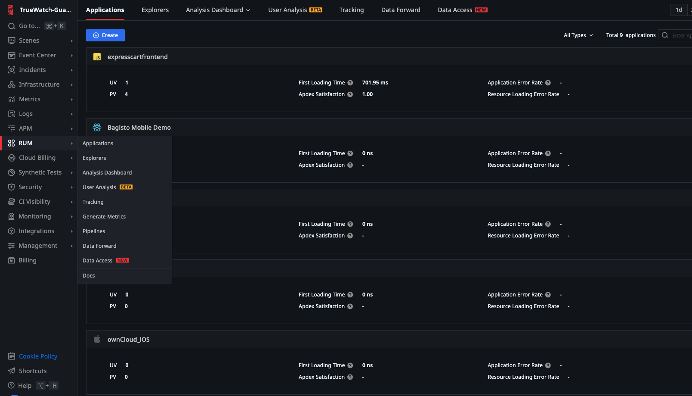
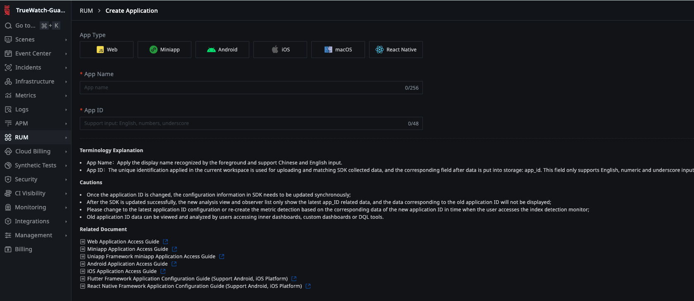
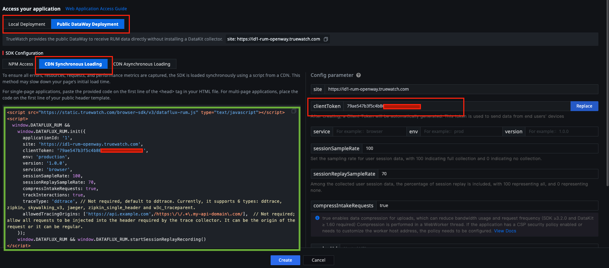
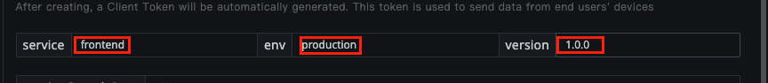
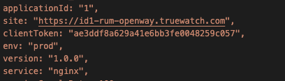

### 🌟 This is Truewatchshop apps based on expresscart by Markmoffat
Check out expresscart documentation [📖 here](https://github.com/mrvautin/expressCart/wiki).

---

> **ℹ️ Intention:**  
> The purpose of **Truewatchshop** is to provide a training sandbox environment for customers and partners.  
> This sandbox allows users to explore, experiment, and learn about monitoring, tracing, and application performance management using Truewatch in a safe, hands-on setting. Application has been instrumented, focus of the training sandbox is how to setup datakit and onboard the data to Truewatch platform

---

### 🛠️ Tech Stack

The project is built using the following technologies:

1. **Node.js**: 🟢 Backend runtime environment for running JavaScript.
2. **Express.js**: 🚀 Web framework for building the application.
3. **MongoDB**: 🗄️ NoSQL database for storing application data.
4. **Docker**: 🐳 Containerization platform for deploying the application.
5. **Nginx**: 🌐 Web server used as a reverse proxy.
6. **Truewatch RUM / APM / LOG**: 📊 Monitoring and tracing tool for performance and debugging. 

---

### ⚙️ Pre-requisites

Before you begin, please make sure you have the following:

1. **Truewatch Account** 📝  
   Register for a Truewatch account at [truewatch.com](https://id1-auth.truewatch.com/businessRegister) to access monitoring and analytics features.

2. **Linux System with Internet Connection** 💻  
   Use a Linux machine (physical or virtual) with a stable internet connection.  
   > *Tip: We recommend using a Linux VM for isolation and ease of setup. If you don’t have one, you can use [Oracle VirtualBox](https://www.virtualbox.org/) or [OrbStack](https://orbstack.dev/) to create a virtual environment.*. 

3. **DataKit Installed** 📦  
   Install DataKit from your Truewatch account to enable tracing and monitoring.  
   Follow the official [DataKit installation guide](https://docs.truewatch.com/datakit/datakit-install/).

4. **Docker** 🐳  
   Install Docker to run the application in containers.  
   [Get Docker instructions here](https://docs.docker.com/get-docker/).

5. **Docker Compose** 🛠️  
   Install Docker Compose to orchestrate multi-container setups.  
   [Get Docker Compose instructions here](https://docs.docker.com/compose/install/).

6. **Git** 🧰  
   Install Git to clone the repository and manage source code:
   ```bash
   sudo apt-get update
   sudo apt-get install -y git
   ```
### Steps to Set Up the Project

1. Clone the repository:
   ```bash
   git clone https://github.com/mailagungdarmawan/expresscart-truewatch-demo.git
   cd expresscart-truewatch-demo
   ```
2. Install dependencies and build the project:
   ```bash
   docker-compose build
   ```
3. Start the services:
   ```bash
   docker-compose up
   ```
4. Populate the database with test data:
   ```bash
   docker exec -it expresscart npm run testdata
   ```

### Steps to Set Up RUM

1. Go To your [Truewatch platfrom](https://id1-auth.truewatch.com), and Login with your Truewatch credentials. 
Create a client token:  
   Go to **Management > Client Token > Create**. Copy the newly created token and save it somewhere safe; you will need this for the next step.  
   

2. Log in to your Truewatch console and go to **Real User Monitoring > Application List > Create Application**.  
   

3. Select **Web** as the **App Type**. Enter a name for the application in the **App Name** field and specify the **App Id**.  
   

4. Select **Public DataWay Deployment**, then choose **CDN Asynchronous Loading**. Enter the **Client Token** you saved earlier in the **clientToken** section.  
   

5. Enter the following values (or values that best describe your application):  
   - **service** = *frontend*  
   - **env** = *production*  
   - **version** = *1.0.0.0*  
   

   copy autogenerated script *highlighted in green* and save it in your favourite editor

6. Instrument Nginx to to use the paramater above, Goto your *expresscart-truewatch-demo* directory on your console, navigate to *nginx/conf.d*
   ```bash
   cd expresscart-truewatch-demo
   cd nginx/conf.d/
   ```
   edit *default.conf* with your favourite editor, and key-in the value from autogenerated script in step 5.
   

7. Start and stop the services:
   ```bash
   docker-compose down
   docker-compose up
   ```
8. open your browser and go to [https://localhost:8080](https://localhost:8080). you should be able to view your webapps running on port 8080. 

9. Interact with your apps, login with user *test@test.com* with passw of *test*. and simulate a user selecting product to cart. 

10. Go To your [Truewatch platfrom](https://id1-auth.truewatch.com), Go to **RUM > Application**, and select your App. Observe statistic under **Analisys Dashboard**.


### Steps to Set Up APM

**WIP**